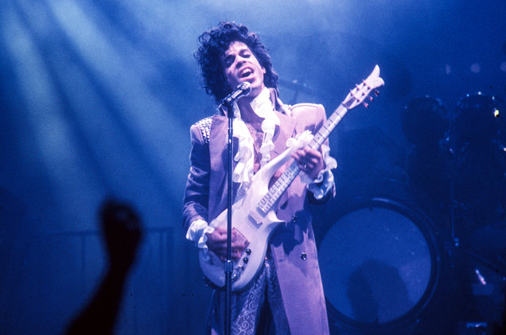

<script>
   $(document).ready(function() {
     $head = $('#header');
     $head.prepend('')
   });
</script>

# Introduction to Part 1

In "Data Science with R" we have worked with tabular or rectangular data which is mostly numeric, character (with short strings of characters) or of type `factor` (categorical), but much of the data proliferating today is unstructured and text-heavy. 
This course gives an introduction on how to work in R with text data.

A pre-requisite for this course is "Data Science with R" (https://github.com/datasciencecampus/DSWR)

We will be mostly using the `tidytext` package and some other ones,  specially `dplyr` and `ggplot2` from the `tidyverse`.

Other packages for Natural Language processing in R are listed, for example, in https://cran.r-project.org/web/views/NaturalLanguageProcessing.html.


<center>
  {width=20%}
</center>

The `tidytext` package, uses tidy data principles to deal with text analyses. The authors of the package found that 

> "using tidy data principles can make many text mining tasks easier, more effective, and consistent with tools already in wide use. Treating text as data frames of individual words allows us to manipulate, summarize, and visualize the characteristics of text easily and integrate natural language processing into effective workflows we were already using."

Recall that tidy data has a specific structure:

* Each variable is a column;

* Each observation is a row;

* Each type of observational unit is a table.

<br>

**Some definitions**

In text analysis we normally have several separate bodies of text (e.g. books, twitter messages, letters, etc.). Each one of these bodies of text is called a **document**. The set of documents is called a **corpus**.

In text analysis we aim to break up each document into a **bag of words**, the set of all words (or other units of interest) in a text, regardless of syntax and/or semantics. 
Every unique word is a **term** and every occurrence of a term is a **token**. 
Creating a bag of words is called **tokenising**.

<div class="alert alert-info">
  
A **token** is a meaningful unit of text, such as a word, that we are interested in using for analysis, and **tokenising** is the process of splitting text into tokens. 

**The tidy text format is a table with one token per row.**

</div>

<br>

For tidy text mining, the token that is stored in each row is most often a single word, but can also be an n-gram, sentence, or paragraph.

The `tidytext` package tokenises by commonly used units of text and converts to a one-term-per-row format.

The tidy text format allows the use of packages in the `tidyverse` for data manipulation, visualisation and processing.

<br>

**REFERENCE**: See the book [Text Mining with R](https://www.tidytextmining.com) by Julia Silge and David Robinson.

<br>

**Required libraries**

We load the libraries we will be using in this part of the course. Please, remember to install the packages before loading the libraries if you haven't installed them yet.

```{r eval=F}
install.packages(c("readr", "dplyr", "tidyr", "stringr", "ggplot2", "gridExtra", "tidytext", "kableExtra", "formattable", "gridExtra", "wordcloud2", "htmlwidgets", "webshot", "textdata"))
```

```{r message=FALSE}
library(readr)# read text files
library(dplyr) #data manipulation
library(tidyr) #data wrangling
library(stringr) #manipulate strings
library(ggplot2) #visualizations
library(gridExtra) #viewing multiple ggplots in a grid
library(tidytext) #text mining
library(textdata) #needed for loading sentiment dictionaries
library(wordcloud2) #creative visualizations
library(webshot) #needed to make wordclouds show
install_phantomjs(force = TRUE) #needed to make wordclouds show
library(htmlwidgets) #needed to make wordclouds show
library(formattable) #formatting tables
library(kableExtra) # for good-looking tables
```


# Text data

Let us consider the following part of a poem by Rumi

>"Do you know what you are?      
>You are a manuscript of a divine letter.      
>You are a mirror reflecting a noble face.      
>This universe is not outside of you.     
>Look inside yourself;     
>everything that you want,    
>you are already that."       

How can the above text be represented  as an R object?

Create a character vector, with one entry per line

```{r}
rumi_poem <- c("Do you know what you are?",      
"You are a manuscript of a divine letter.",      
"You are a mirror reflecting a noble face.",      
"This universe is not outside of you.",    
"Look inside yourself;",     
"everything that you want,",   
"you are already that.")

rumi_poem
```

We can create a tibble with the vector

```{r warning=FALSE, message=FALSE}
#library(dplyr)
rumi_poem_df <- tibble(line = 1:length(rumi_poem), text = rumi_poem)
rumi_poem_df
```

In order to focus on the words used in the poem, we need to break the text into individual tokens (in our case words). This will enable the analysis to take place. We use the function `unnest_tokens()` from the package `tidytext`.

```{r warning=FALSE}
#library(tidytext)
rumi_poem_tk <- rumi_poem_df %>% 
  unnest_tokens(word, text)

glimpse(rumi_poem_tk)
```

`word` is the name of the column created with tokens from the column `text` in `rumi_poem_df`.

Note that by default the punctuation has been eliminated and the tokens are converted to lower case. 
This can be changed by adding the argument `to_lower = FALSE` in `unnest_tokens()`. Try it out!

<br>

<div class="alert alert-info">
The default tokenisation is words but there are other options: characters, n-grams, sentences, lines, paragraphs, etc. See, https://juliasilge.github.io/tidytext/reference/unnest_tokens.html
</div>

<br>

Now that we have Rumi's poem tokenised, we can try and see what the word frequency is using the `count()` function from `dplyr`.

```{r}
rumi_poem_tk %>% count(word, sort = T)
```

**EXERCISE.**
Obtain the word frequency in Sylvia Plath's poem "Melodious Hearts". Can you see a difference with Rumi's poem?

>I shut my eyes and all    
>the world drops dead;    
>I lift my lids and all   
>is born again.   
>I think I made you up    
>inside my head.    

```{r}
plath_poem <- c("I shut my eyes and all", 
                "the world drops dead;",
                 "I lift my lids and all",
                 "is born again.",   
                 "I think I made you up",    
                 "inside my head.")
```
Scroll down for solution, but try to solve the problem on your own.

<br>

<br>

<br>

<br>

<br>

<br>

<br>

<br>

<br>

<br>

<br>

<br>

<br>

<br>


```{r warning=FALSE, message=FALSE}
plath_poem_df <- tibble(line = 1:length(plath_poem), text = plath_poem)
plath_poem_df
```

```{r}
plath_poem_tk <- plath_poem_df %>% 
  unnest_tokens(word, text)
```

```{r}
plath_poem_tk %>% count(word, sort = T)
```

<br>

<br>


To compare, we will produce barplots of the 10 most used words in Rumi's and Plath's poems.


```{r}
#barplot for Rumi's poem
rumi_plot <- rumi_poem_tk %>% 
  count(word, sort =T) %>% 
  slice(1:10) %>% 
  ggplot(aes(x = reorder(word, n), y = n)) + #x should map to word but if we do not do the reordering, the bars will be ordered by alphabetical order of the words.
  geom_col() +
  coord_flip() +
  labs(x = "Word", y = "Count") +
  ggtitle("Rumi")
```

```{r}
#barplot for Plath's poem
plath_plot <- plath_poem_tk %>% 
  count(word, sort =T) %>% 
  slice(1:10) %>% 
  ggplot(aes(x = reorder(word, n), y = n)) +
  geom_col() +
  coord_flip() +
  labs(x = "Word", y = "Count") +
  ggtitle("Plath")
```

```{r}
library(gridExtra)
grid.arrange(rumi_plot, plath_plot, nrow = 1)
```

# Sentiment analysis

Sentiment analysis aims to determine the opinion and subjectivity contained in text.

One possible way to analyse the sentiment contained in text is to think of it as the combination of words, where each word belongs to a certain sentiment or feeling category. Then the sentiment of a text is the aggregation of the sentiment classes contained in its words.

The `tidytext` package contains several sentiment lexicons that can be used to map individual words to a sentiment class. The difference between the lexicons is the number and type of classes that sentiments are split into and the mapping of words into these classes.

Three general purpose lexicons are:

* AFINN. Compiled by Finn Aarup Nielsen. The AFINN lexicon is a list of English terms manually rated for valence with an integer between -5 (negative) and +5 (positive). Negative values correspond to negative sentiments and positive values to positive sentiments.

* BING. By Bing Liu and collaborators. This lexicon maps words into two categories: "positive" and "negative" categories.

* NRC. From Saif Mohammad and Peter Turney. Sentiments are classified into 10 overlapping categories, "positive",   "negative", "anger", "anticipation", "disgust", "fear", "joy", "sadness", "surprise" and "trust". 
 The categories are not mutually exclusive as a word can be mapped into more than one sentiment.

All the information from the lexicons is contained in the data set `sentiments` and it can be accessed using the `get_sentiments()` function of `tidytext`.


```{r}
get_sentiments("nrc")
```

```{r}
get_sentiments("afinn")
```

```{r}
get_sentiments("bing")
```

Now let us see the sentiment in Rumi's and Plaths's poems. We will use the AFINN lexicon.

```{r}
rumi_afinn <- rumi_poem_tk %>%
  inner_join(get_sentiments("afinn"))
```

```{r}
rumi_afinn
```

```{r}
plath_afinn <- plath_poem_tk %>%
  inner_join(get_sentiments("afinn"))
```

```{r}
plath_afinn
```

As we can see the sum of sentiments in Rumi's poem is 3 whilst it is -3 in Plath's poem. 

<br>

**EXERCISE.** Find the sentiment of Rumi's and Plath's poems using the BING lexicon. What are your conclusions?

<br>

<br>

<br>

<br>

<br>

<br>

<br>

<br>

<br>

<br>

<br>

<br>


```{r}
rumi_bing <- rumi_poem_tk %>%
  inner_join(get_sentiments("bing"))
```

```{r}
rumi_bing
```

```{r}
plath_bing <- plath_poem_tk %>%
  inner_join(get_sentiments("bing"))
```

```{r}
plath_bing
```

<br>

<br>

<br>

* Note how not all English words are in the lexicons. This is due in part due to the fact that many words are neutral.

* This method doesn't take into account qualifiers before a word, e.g. "no good", "not true", etc. The mentioned lexicons are based on unigrams.

* The size of the text being analysed for sentiment can have an effect on the sentiment score. When considering many paragraphs, some will have positive and others negative sentiment and they could average out to zero. Smaller sized pieces of text, such as a sentence or a single paragraph, can give a better idea of sentiment.

* The lexicons were formed via crowdsourcing or manual labour of the author. 
 They were validated using a combination of crowdsourcing, restaurant or film reviews, or Twitter data. 
 Given this information we may hesitate to apply the mentioned lexicons to styles of text very different from the texts    they were validated on, such as, for example, poems or literature from 200 years ago. 
 The lexicons can still be useful though. Note that there exist domain specific sentiment lexicons. 
 For example, the Loughran and McDonald dictionary was compiled specifically for sentiment analysis of financial reports.  The lexicon is in the `tidytext` package and it is called "loughran".

* There are other, more advanced methods for sentiment analysis, e.g. training a known dataset, creating your own classifiers with rules, etc.
  
<br>  

**A closer look at the lexicons**

In order to examine the lexicons, we will create a new tibble called `sentiments_new`. 

Create a new column, `sentiment`, for the AFINN lexicon by converting the numerical score to positive or negative. 
Join up the 3 lexicon tibbles and add a column with the word count for each lexicon.

```{r}
#Let us classify the afinn sentiments into two categories: positive and negative
sentiments_affin <- get_sentiments("afinn") %>%
  mutate(sentiment = ifelse(value >= 0, "positive", "negative")) %>%
  select(-value) %>%
  mutate(lexicon = "AFINN")
```

```{r}
#the NRC sentiments
sentiments_nrc <- get_sentiments("nrc") %>%
  mutate(lexicon = "NRC")
```

```{r}
#BING sentiments
sentiments_bing <- get_sentiments("bing") %>%
  mutate(lexicon = "BING")
```

```{r}
#Let us put the three lexicons together
sentiments_new <- sentiments_affin %>% 
  bind_rows(sentiments_nrc) %>% 
  bind_rows(sentiments_bing) %>%
  group_by(lexicon) %>%
  mutate(words_in_lexicon = n_distinct(word)) %>%
  ungroup()
```

Let us save `sentiments_new` in a .csv file so we can use it later

```{r}
write_csv(sentiments_new, "data/sentiments_new.csv")
```


```{r}
#this function is to print a table using kable and kableExtra
my_kable_styling <- function(dat, caption) {
  kable(dat, "html", escape = FALSE, caption = caption) %>%
  kable_styling(bootstrap_options = c("striped", "condensed", "bordered"),
                full_width = FALSE)
}
```


```{r message=FALSE, warning=FALSE}  
sentiments_new %>%
  group_by(lexicon, sentiment, words_in_lexicon) %>%
  summarise(distinct_words = n_distinct(word)) %>%
  ungroup() %>%
  pivot_wider(names_from = sentiment, values_from = distinct_words) %>%
  mutate(lexicon = color_tile("lightblue", "lightblue")(lexicon),
         words_in_lexicon = color_bar("lightpink")(words_in_lexicon))  %>% #color_tile() and color_bar() are from package formattable
  my_kable_styling(caption = "Word Counts Per Lexicon")
```

The table above gives an idea of the size and structure of each lexicon.


# CASE STUDY - Prince lyrics

All the credit goes to Debbie Liske who wrote 
[a blog](https://www.datacamp.com/community/tutorials/R-nlp-machine-learning)
upon which these notes are based. 
I have changed some code to simplify it and to try and imbed it in the Tidyverse as much as possible. I also cleaned up the raw data file.


## Introduction
From an [article in The Guardian](
https://www.theguardian.com/music/2015/may/19/new-study-reveals-lyric-intelligence-getting-lower)

>Is lyrical intelligence getting lower? A new study suggests the complexity of lyrics is declining, comparing words used in songs to reading levels in US schoolchildren ("Hip-hop ain't top: new study reveals reading levels behind music lyrics". The Guardian 19/5/15)

One can use text mining, NLP, machine learning and other data science methods to shed insight into "lyrical intelligence" and also to identify themes that appeal to society based on how well a song is received, and, perhaps, predict whether a song will do well based on lyrical analysis alone.

## Prince



To celebrate the inspiring and diverse body of work left behind by Prince (1958 - 2016), we will explore some of the sometimes obvious, but often hidden, messages in his lyrics. 
However, you don't have to like Prince's music to appreciate the influence he had on the development of many genres globally. 
Rolling Stone magazine listed Prince as the 18th best songwriter of all time, just behind the likes of Bob Dylan, John Lennon, Paul Simon, Joni Mitchell and Stevie Wonder. 
Lyric analysis is slowly finding its way into data science communities as the possibility of predicting "Hit Songs" approaches reality.

>Prince was a man bursting with music - a wildly prolific songwriter, a virtuoso on guitars, keyboards and drums and a master architect of funk, rock, R&B and pop, even as his music defied genres. (New York Times)

## Questions of interest

We will first run a general exploratory data analysis. What does the data look like? How many songs are there? How are the lyrics structured? How much cleaning and wrangling needs to be done? What are the facts? What are the word frequencies and why is that important? 


## Reading in the data

The original data provided by Debbie Liske is in the "data" subfolder in the file "prince_raw_data.csv". However, I noticed that the lyrics were not too clean and I edited them. I also removed some "songs" which were other text, not really songs. So, we will use the data file "prince_new.csv".

Read in the data with information about Prince's authored songs, including their lyrics.

```{r message=FALSE}
prince <- read_csv("data/prince_new.csv")
names(prince)
```

In `prince`:

`lyrics`: song lyrics. 

The other columns include song, year, and peak (which shows its placement on the Billboard charts). 

`us_pop` and `us_rnb` are peak chart positions for the US (Pop and R&B charts). 

<br>

We use `%>%`, which is the pipe operator. It passes on the output on its left to the first argument (input) of the function on its right.

Let us obtain some general descriptors of the data.

```{r}
summary(prince)
```  
  
There are 37 years of songs, 1978 to 2015, and the lowest charted song (that exists in the dataset) is at position 88. 
There are quite a few NAs for year and peak.


Let us further inspect the data by looking at the 129th row, with info about the song "Controversy".

```{r}
glimpse(prince[129,])
```
```{r}
nrow(prince)
```

Prince was a prolific song writer: 809 songs.

Let us look at how the lyrics data is structured. For song 129, "Controversy"

```{r}
prince %>% slice(129) %>% select(lyrics)
#str(prince[129, ]$lyrics, nchar.max = 300)
```


## Song Stats

Using `dplyr`'s functions `filter()` (to select rows), `group_by()` (to group data by values of a categorical variable),  `summarise()` and `n()` (counts the number of entries of a vector), we can group by decade and then count the number of songs. Then, using `ggplot()` with the geometry `geom_bar()`, create a bar chart and fill the bars with the charted category.


```{r}
aux <- prince %>%
  filter(decade != "NA") %>%
  group_by(decade, charted) %>%
  summarise(number_of_songs = n())
aux
```

```{r}
  ggplot(aux, aes(x = decade, y = number_of_songs, fill = charted)) + 
  geom_bar(stat = "identity")  +
  ggtitle("Released Songs") +
  labs(x = NULL, y = "Song Count")
```

This clearly shows Prince's most active decade was the 1990s.

<br>

Now, let us obtain a similar plot but for charted songs only (select rows, with `filter()`, where `peak`> 0).


```{r}
charted_songs_over_time <- prince %>%
  filter(peak > 0) %>%
  group_by(decade, chart_level) %>%
  summarise(number_of_songs = n())
charted_songs_over_time
```

```{r}
  charted_songs_over_time %>% 
  ggplot(aes(x = decade, y = number_of_songs, fill = chart_level)) + 
  geom_bar(stat = "identity") +
  labs(x = NULL, y = "Song Count") +
  ggtitle("Charted Songs")
```

Notice that out of all Prince's charted songs, the majority reached Top 10. But what is even more interesting is that his most prolific decade for new songs was the 1990s, yet more chart hits occurred in the 1980s. 


<br>


In order to use the power of the full dataset for lyrical analysis, you can remove references to chart level and release year and have a much larger set of songs to mine. So, now we don't filter by `peak > 0` or `decade != NA`. Charted songs must have a release year and hence a decade. Uncharted songs may have unknow release year.

```{r}
#look at the full data set at your disposal
prince %>%
  group_by(decade, chart_level) %>%
  summarise(number_of_songs = n()) %>%
  ggplot(aes(x = decade, y = number_of_songs, fill = chart_level)) +
  geom_bar(stat = "identity")  +
  labs(x = NULL, y = "Song Count") +
  ggtitle("All Songs in Data")
```

**EXERCISE.** List Prince's songs that hit No.1 in the charts. Present the list by ascending order of `year`.

Don't scroll down if you want to attempt the solution on your own. 

Hint: use `filter()` by `peak`.

Your Solution:


<br>

<br>

<br>

<br>

<br>

<br>

<br>

<br>

<br>

<br>

<br>

<br>

<br>

<br>

<br>

**Solution**
```{r}
prince %>%
  filter(peak == "1") %>%
  select(year, song, peak) %>%
  arrange(year)
```  


## Text Mining

Text mining can also be thought of as text analytics. The goal is to discover relevant information contained in text. 

Natural Language Processing (NLP) is one methodology used in mining text. It tries to decipher the ambiguities in written language by tokenization, clustering, extracting entity and word relationships, and using algorithms to identify themes and quantify subjective information. 

Begin by breaking down the concept of **lexical complexity**.
Lexical complexity can mean different things in different contexts, but for now, assume that it can be described by a combination of measures such as

* Word Frequency: number of words per song

* Word Length: average length of individual words in a text

* Lexical Diversity: number of unique words used in a text (song vocabulary)

* Lexical Density: the number of unique words divided by the total number of words (word repetition)

<br>

To begin the analysis, we need to:

- clean the data,

- break out the lyrics into individual words, the process called **tokenization**.

Once the two steps are carried out, we can start mining for insights.


### Cleaning the data

Only meaningful, real words should be retained for analysis.

-  Expand contractions such as won't, can't, etc.

```{r}
prince <- prince %>% 
  mutate(lyrics = str_replace_all(lyrics, "won't", "will not")) %>%
  mutate(lyrics = str_replace_all(lyrics, "can't", "can not")) %>%
  mutate(lyrics = str_replace_all(lyrics, "n't", " not")) %>%
  mutate(lyrics = str_replace_all(lyrics, "'ll", " will")) %>%
  mutate(lyrics = str_replace_all(lyrics, "'re", " are")) %>%
  mutate(lyrics = str_replace_all(lyrics, "'ve", " have")) %>%
  mutate(lyrics = str_replace_all(lyrics, "'m", " am")) %>%
  mutate(lyrics = str_replace_all(lyrics, "'d", " would")) %>%
  mutate(lyrics = str_replace_all(lyrics, "'s", " ")) # 's could be 'is' or could be possessive: it has no expansion
```  

- Remove special characters

<!-- selecting items with [^...] gives out an inverted character list, matches any characters except those inside the square brackets.-->

```{r}
#remove special characters: remove everything except the letters a to z, A to Z, and the numbers 0 to 9
prince <- prince %>%
  mutate(lyrics = str_replace_all(lyrics, "[^a-zA-Z0-9 ]", " "))
```

- Convert all letters to lower case with the `tolower()` function.

```{r}
# convert letters to lower case
prince <- prince %>% mutate(lyrics = tolower(lyrics)) 
```

Let us inspect row 129 again

```{r}
prince %>% slice(129) %>% select(lyrics)
```


### Tokenizing

There are different methods and data formats that can be used to mine text. We will use
"Tidy Text", a table with one token (word) per row.

**Tokenization is the process of splitting the lyrics into tokens. We will use the function `unnest_tokens()` in `tidytext`  to do this.**


We need to both break the text into individual tokens (tokenization) and transform it to a tidy data structure. 

The function `unnest_tokens()`, useful to tokenize, requires at least two arguments: the output column name that will be created as the text is unnested into it (`word`, in this case), and the input column that holds the current text (i.e. `lyrics`).

After the lyrics text has been tokenized, one must do some further cleaning. 

1. So called "stop words" must be removed.
Stop words are overly common words that may not add any meaning to results. There are different lists to choose from, but here we will use the lexicon called `stop_words` from the `tidytext` package.

We can use `sample()` to show a random list of these stop words.

```{r}
sample(stop_words$word, 15)
```

So, after tokenizing the lyrics into words, you can then use dplyr's `anti_join()` (`anti_join(x, y)` returns all rows from x where there are not matching values in y, keeping just columns from x) to remove stop words. 

2. Next, get rid of undesirable words. 

Many lyrics, when transcribed, include phrases like "Repeat Chorus", or labels such as "Bridge" and "Verse". There are also a lot of other undesirable words that can muddy the results. Based on prior analysis, a list of superfluous words was made

```{r}
undesirable_words <- c("chorus", "repeat", "lyrics", 
                       "theres", "bridge", "fe0f", "yeah", "baby", 
                       "alright", "wanna", "gonna", "chorus", "verse", 
                       "whoa", "gotta", "make", "2", 
                       "4", "ooh", "uurh", "pheromone", "poompoom", "3121", 
                       "matic", " ai ", " ca ", " la ", "hey", " na ", 
                       " da ", " uh ", " tin ", "  ll", "transcription",
                       "repeats")
```                       
                       
                      

3. Remove all words with fewer than four characters. This is another subjective decision, but in lyrics, these are often interjections such as "yea" and "hey". 

4. Store the results into `prince_words_filtered`.


**Note**: `prince_words_filtered` is the tidy text version of the `prince` tibble without 1) stop words, 2) undesirable words, and 3) 1-3 character words. 


```{r}
#tokenize and remove stop, undesirable and short words
prince_words_filtered <- prince %>%
  unnest_tokens(word, lyrics) %>% # tokenizing
  anti_join(stop_words) %>% #removing stop words
  filter(!word %in% undesirable_words) %>% #remove undesirable words
 # distinct() %>% 
  filter(nchar(word) > 3) # remove short words

write_csv(prince_words_filtered, "data/prince_tidy_filtered.csv")
```

```{r}
names(prince_words_filtered)
```

Note how `prince_words_filtered` doesn't contain the column `lyrics`; instead it contains column `word`.

```{r}
nrow(prince_words_filtered)
```

Here is a snapshot of `prince_word_filtered`: just 10 rows where `word` is "race".
This shows the tokenized, unsummarized, tidy data structure.


```{r}
prince_words_filtered %>% 
  filter(word == "race") %>% #keep rows where `word`="race"
  select(word, song, year, peak, decade, chart_level, charted) %>% #select columns
  arrange() %>% #sort in alphabetical order of `song` 
  top_n(10, song) #top 10 rows where sorting is by song
```


## Word Frequency

In music, individual word frequencies carry a great deal of importance, whether it be repetition or rarity. 
Both affect memorability of the entire song itself. One question a songwriter may want to know is if there is a correlation between word frequency and hit songs. 
So now you want to take the tidy format one step further and get a summarized count of words per song.


To examine this format in Prince's lyrics, create a histogram showing the distribution of word counts, grouped by song, per placement on the Billboard Charts. 
Unnest Prince's lyrics again without filtering any words (stop, undesirable, repeated or short words) to get a true count of word frequency across songs. 
Again use `group_by()` and `summarise()` to get counts. 
Then use the `dplyr` function `arrange()` to sort by count. 
First, take a look at the highest counts, then use `ggplot()` for the histogram.
                  
```{r}                  
full_word_count <- prince %>%
  unnest_tokens(word, lyrics) %>% #tokenize
  group_by(song,chart_level) %>% #group data
  summarise(num_words = n()) %>% #number of words(rows) per group
  arrange(desc(num_words)) %>% #sort by descending order of nr of words
  ungroup()

full_word_count[1:10,]
```                  


```{r message=FALSE, warning=TRUE}
full_word_count %>%
  ggplot(aes(x = num_words, fill = chart_level )) +
    geom_histogram() +
    ylab("Song Count") + 
    xlab("Word Count per Song") +
    ggtitle("Word Count Distribution")
```
There is a Top 10 charted song with an unusually high word count. 

<br>

**EXERCISE** Find out the name of the song that charted in the Top 10 and had more than 800 words. 

Also, get the chart information for this song (in `prince`).

Don't scroll down if you wish to attempt the solution yourself.

<br>

<br>

<br>

<br>

<br>

<br>

<br>

<br>

<br>

<br>

<br>

<br>

<br>

<br>

<br>

<br>

<br>

<br>

<br>

<br>

<br>

<br>

```{r}
full_word_count %>%
  filter(chart_level == 'Top 10' & num_words > 800) %>% # this contains the song name info
  left_join(prince, by = "song") %>% #this will join matching rows from object prince to obtain chart info
  select(Song = song, 
         "Word Count" = num_words, 
         "Peak Position" = peak, 
         "US Pop" = us_pop, 
         "US R&B" = us_rnb)
```

This song, "My name is Prince" has a guest artist who performs a rap section. That certainly explains the increased number of words. 


## Top Words

In order to do a simple evaluation of the most frequently used words in the full set of lyrics, you can use `count()` and `top_n()` to get the n top words from the clean, filtered dataset `prince_words_filtered`. Then use `reorder()` to sort words according to the count and use `dplyr`'s `mutate()` verb to reassign the ordered value to word. This allows `ggplot()` to display it nicely.

```{r}
aux <- prince_words_filtered %>%
  count(word, sort = TRUE) %>% #the output has 2 columns word and n (the counts of each word)
  top_n(10) %>% #select the 10 top rows
  ungroup() %>%
  mutate(word = reorder(word, n))

aux
```


```{r}
  ggplot(aux, aes(x = word, y = n)) +
    geom_col(fill = "purple") +
    theme(legend.position = "none", 
          plot.title = element_text(hjust = 0.5),
          panel.grid.major = element_blank()) +
    xlab("") + 
    ylab("Song Count") +
    ggtitle("Most Frequently Used Words in Prince Lyrics") +
    coord_flip()
```

As in most popular music, love seems to be a common topic. 

Now, let us have some visual fun.


## Word Clouds

Word clouds get a bad rap in many circles and, if not careful, they can be used out of context where they are not appropriate. However, by nature, we are all very visual beings, and there are cases where real insight can be gained. Just use them with a grain of salt.

But for now, take a look at a new package called `wordcloud2` for some cool stuff. This package gives you a creative collection of clouds that generate "html widgets". You can actually hover over a word to see its frequency in the text. (This package can be slow to render in RMarkdown and is often picky about the browser it uses. Hopefully improvements will be made.)

```{r}
prince_words_counts <- prince_words_filtered %>%
  count(word, sort = TRUE) 
```

```{r}
wordcloud2(prince_words_counts[1:300, ], size = .5)
```

```{r  message=FALSE, warning=FALSE}
wordball <- wordcloud2(prince_words_counts[1:300, ], size = .5, ellipticity = 0.9)
wordball
```


```{r  message=FALSE}
#library(wordcloud2)
#library(webshot)
#install_phantomjs(force = TRUE)
#library(htmlwidgets)
saveWidget(wordball, "tmp.html", selfcontained = F)
webshot("tmp.html", "wordball.png", delay = 10, vwidth = 500, vheight = 500)
```


```{r wordoval}
wordoval <- wordcloud2(prince_words_counts[1:300, ], size = .7, backgroundColor = "grey")
wordoval
```

```{r  message=FALSE}
#library(wordcloud2)
#library(webshot)
#install_phantomjs(force = TRUE)
#library(htmlwidgets)
saveWidget(wordoval, "tmp.html", selfcontained = F)
webshot("tmp.html", "wordoval.png", delay = 10, vwidth = 500, vheight = 500)
```


```{r}
word_rectangle <- wordcloud2(prince_words_counts[1:300,], size = 1)
```

```{r  message=FALSE}
#library(wordcloud2)
#library(webshot)
#install_phantomjs(force = TRUE)
#library(htmlwidgets)
saveWidget(word_rectangle, "tmp.html", selfcontained = F)
webshot("tmp.html", "word_rectangle.png", delay = 10, vwidth = 500, vheight = 500)
```


Purple was Prince's favourite colour.

```{r}
word_star <- wordcloud2(prince_words_counts[1:300,], shape = "star", size = 0.3, color = "purple")
```

```{r  message=FALSE}
#library(wordcloud2)
#library(webshot)
#install_phantomjs(force = TRUE)
#library(htmlwidgets)
saveWidget(word_star, "tmp.html", selfcontained = F)
webshot("tmp.html", "word_star.png", delay = 10, vwidth = 500, vheight = 500)
```


## Popular Words

So far you've just viewed the top words across all songs. What happens if you break them up by chart level? Are some words more prevalent in songs that reached the charts versus uncharted songs? These are considered popular words by society.

We will extract the 10 most common words for each chart level.

```{r}
popular_words <- prince_words_filtered %>% 
  group_by(chart_level) %>%
  count(word, sort = TRUE) %>%
  slice(seq_len(10)) %>%  #choose the first 10 rows for each chart level
  ungroup() 

popular_words
```


```{r}
popular_words = popular_words %>% mutate(row = row_number()) #this creates and appends a column with row numbers
popular_words
```


```{r message=F, warning=F}
popular_words %>%
  ggplot(aes(x = row, y = n, fill = chart_level)) +
    geom_col(show.legend = FALSE) + #don't show a legend below the columns
    labs(x = NULL, y = "Song Count") +
    facet_wrap(~chart_level , scales = "free") +
    scale_x_continuous( breaks = popular_words$row, labels = popular_words$word) + # This handles labeling with words
    coord_flip() +
    ggtitle("Popular Words by Chart Level")  
   
```

 The top words across the chart levels are very, very similar. This doesn't look good for our hopes of predicting whether a song will succeed based on lyrics! 
 
 
 
## TF-IDF

TF-IDF is a statistic that measures how important a word is to a document in the context of a collection (corpus) of documents.

The methods so far look at the entire dataset without addressing how to quantify how important words are with respect to an entire collection. You have looked at term frequency, and removed stop words, but this may not be the most sophisticated approach.

TF stands for "term frequency". IDF stands for "inverse document frequency", which attaches a lower weight for commonly used words and a higher weight for words that are not used much in a collection of text. 

When you combine TF and IDF, a term's importance is adjusted for how rarely it is used. 

The assumption behind TF-IDF is that terms that appear more frequently in a document should be given a higher weight, unless the word also appears in many documents. 

The formula is summarized below:

- Term Frequency (TF): Number of times a term occurs in a document/number of documents

- Inverse Document Frequency (IDF) = log(nr.documents/nr.documents containing the term) = - log(nr.docs contain term / nr. docs)

TF-IDF = TF * IDF 


The IDF of any word is therefore a higher number for words that occur in fewer of the documents in the collection. 

You can use this new approach to examine the most important words per chart level with the `bind_tf_idf()` function provided by `tidytext`. 
This function calculates and binds the TF and IDF, along with the TF*IDF product. 
It takes a tidy text dataset as input with one row per token, per document. 

`bind_tf_idf()` has three arguments: first the token (word), the second is the set of documents (in the example below, it's chart level), the third is the count (how many times each word appears in each document)

Take the `prince` data frame and unnest tokens to words, remove undesirable words, but leave in the stop words. 
Then use `bind_tf_idf()` to run the formulas and create new columns.

```{r}
popular_tfidf_words <- prince %>%
  unnest_tokens(word, lyrics) %>%
 # distinct() %>%
  filter(!word %in% undesirable_words) %>%
  filter(nchar(word) > 3) %>%
  count(chart_level, word, sort = TRUE) %>%
  ungroup() %>%
  bind_tf_idf(word, chart_level, n)
```

The 10 least important words, according to tf-idf

```{r}
head(arrange(popular_tfidf_words, tf_idf),10)
```

The 10 most tf-idf important words 

```{r}
tail(arrange(popular_tfidf_words, tf_idf),10)
```

```{r}
top_popular_tfidf_words <- popular_tfidf_words %>%
  arrange(desc(tf_idf)) %>%
  mutate(word = factor(word, levels = rev(unique(word)))) %>%
  group_by(chart_level) %>% 
  slice(seq_len(10)) %>%
  ungroup() %>%
  mutate(row = row_number())
```

```{r eval=F}
top_popular_tfidf_words %>%
  ggplot(aes(x = row, tf_idf, 
             fill = chart_level)) +
    geom_col(show.legend = FALSE) +
    labs(x = NULL, y = "TF-IDF") + 
    ggtitle("Important Words using TF-IDF by Chart Level") +
    facet_wrap(.~chart_level, scales = "free") +
    scale_x_continuous(  # This handles replacement of row 
      breaks = top_popular_tfidf_words$row, # notice need to reuse data frame
      labels = top_popular_tfidf_words$word) +
    coord_flip()
```    
 Using TF-IDF certainly gives us a different perspective on potentially important words. Of course, the interpretation is purely subjective. Notice any patterns?
   


 
 
 
 